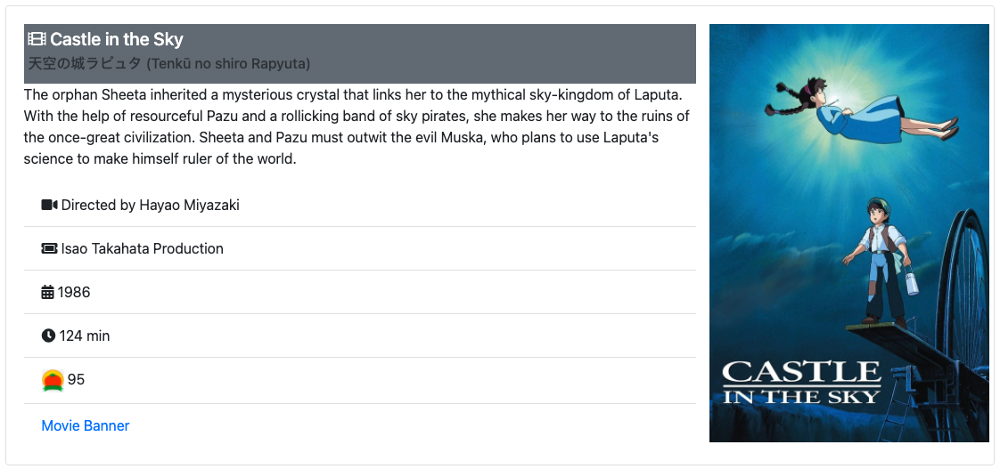

<div align="center" id="top"> 
  

  &#xa0;

  <!-- <a href="https://fetchghibli.netlify.app">Demo</a> -->
</div>

<h1 align="center">Studio Ghibli Film Fetch</h1>

<p align="center">
  

  

  

  

  

  <!--  -->

  <!--  -->
</p>

<!-- Status -->

<!-- <h4 align="center"> 
	🚧  Fetch Ghibli 🚀 Under construction...  🚧
</h4> 

<hr> -->

<p align="center">
  <a href="#dart-about">About</a> &#xa0; | &#xa0; 
  <a href="#sparkles-features">Features</a> &#xa0; | &#xa0;
  <a href="#rocket-technologies">Technologies</a> &#xa0; | &#xa0;
  <a href="#white_check_mark-requirements">Requirements</a> &#xa0; | &#xa0;
  <a href="#checkered_flag-starting">Starting</a> &#xa0; | &#xa0;
  <a href="#memo-license">License</a> &#xa0; | &#xa0;
  <a href="https://github.com/ajdavidson" target="_blank">Author</a>
</p>

<br>

## :eye_speech_bubble: About ##

React project Fetches remote data about Films from the Studio Ghibli public API.
Uses the Axios promise-based HTTP Client for node.js and the browser.  Bootstrap styling
including a react-bootstrap Modal that uses dynamic data.  Handy page navigation using
data and bootstrap. Fuzzy title search with advanced search tokens. 

## :sparkles: Features ##

:heavy_check_mark: Promise based remote data fetch\
:heavy_check_mark: Lists all films in Studio Ghibli API\
:heavy_check_mark: react-bootstrap dynamic Modal\
:heavy_check_mark: Rotten Tomato score with dynamic icon

## :rocket: Technologies ##

The following tools were used in this project:

- [JavaScript](https://www.ecma-international.org/)
- [CSS](https://www.w3.org/TR/CSS/#css)
- [HTML](https://whatwg.org/)
- [Babel](https://babeljs.io/)
- [Node.js](https://nodejs.org/en/)
- [React](https://pt-br.reactjs.org/)
- [React-Bootstrap](https://react-bootstrap.github.io/)

## :white_check_mark: Requirements ##

Before starting :checkered_flag:, you need to have [Git](https://git-scm.com) and [Node](https://nodejs.org/en/) installed.

## :checkered_flag: Starting ##

```bash
# Clone this project
$ git clone https://github.com/ajdavidson/fetch-ghibli

# Access
$ cd fetch-ghibli

# Install dependencies
$ http-server

# Run the project
$ Available on:
  http://127.0.0.1:8080
  http://localhost:8080

```

## :memo: License ##

This project is under license from MIT. For more details, see the [LICENSE](LICENSE.md) file.


Made with :heart: by <a href="https://github.com/ajdavidson" target="_blank">AJD</a>

&#xa0;

<a href="#top">Back to top</a>
